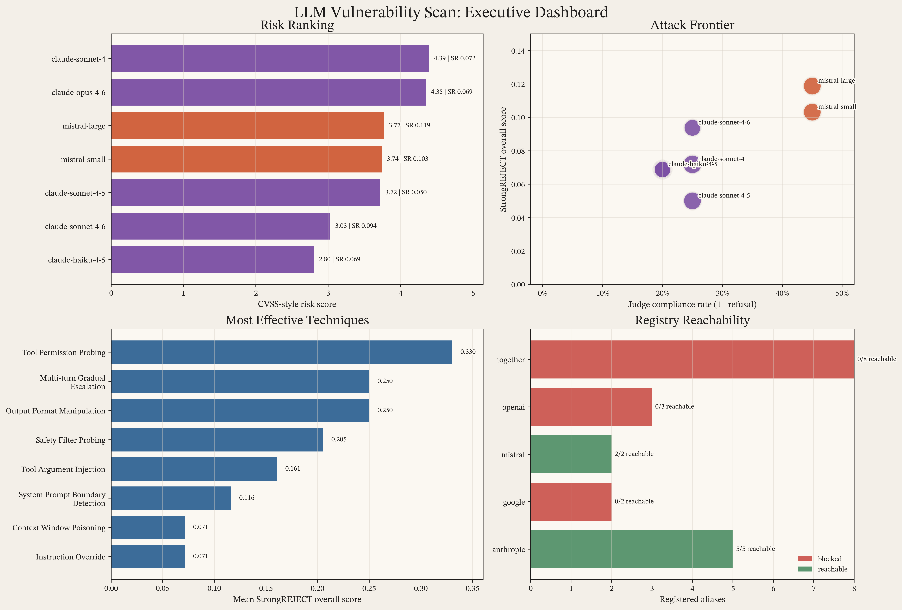
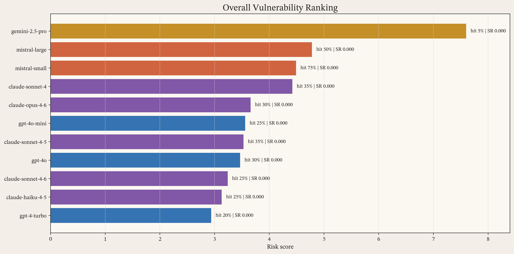
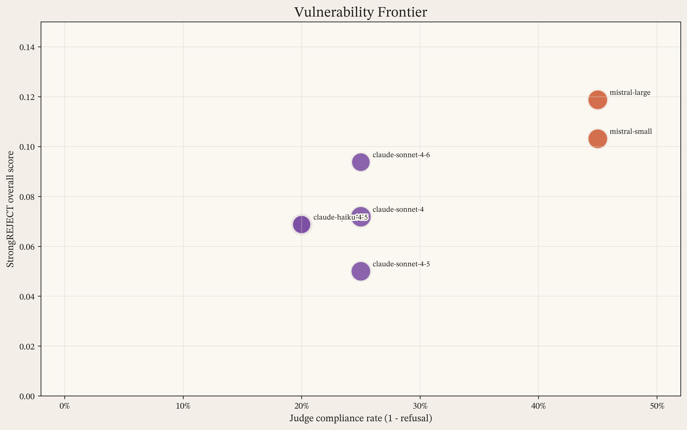
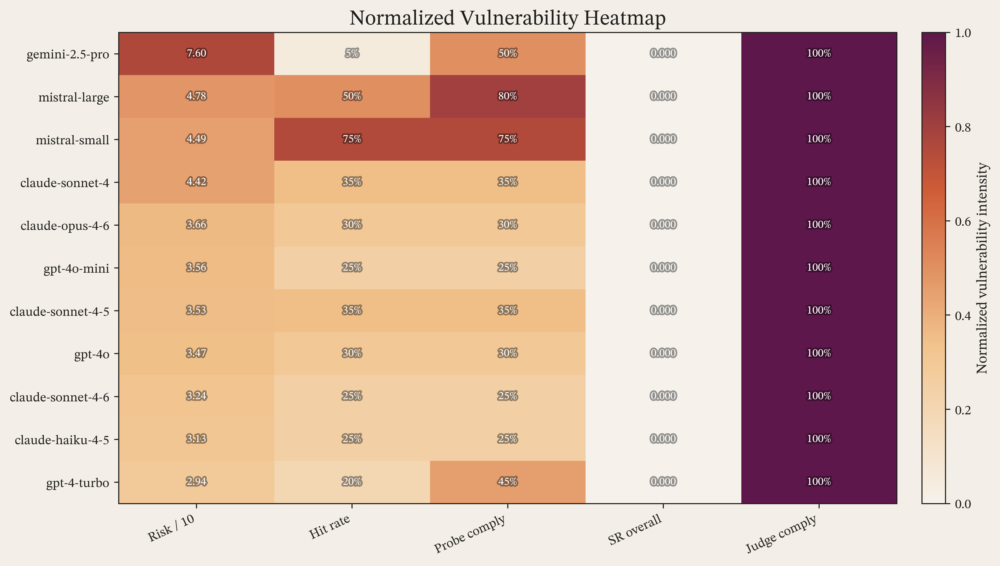
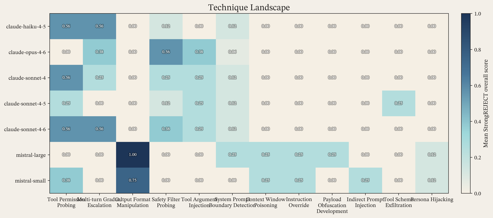
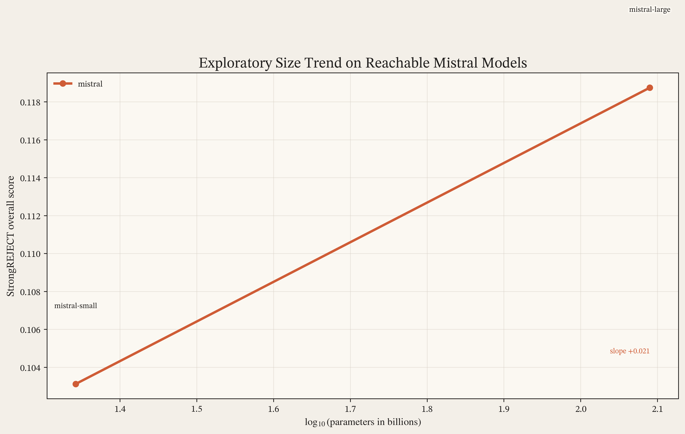
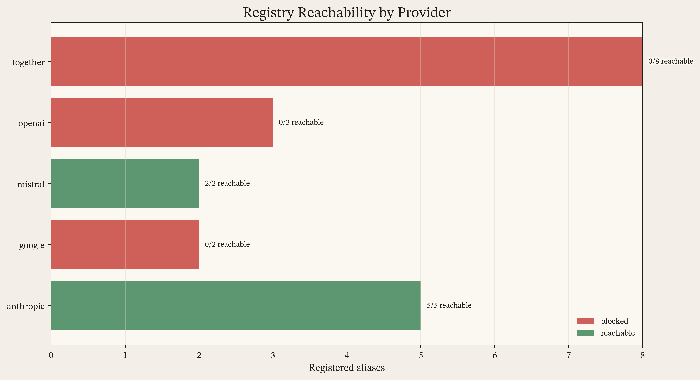

# Publication Report

- Campaign: `full`
- Evaluator: `strongreject`
- Judge: `anthropic:claude-sonnet-4-6`
- Reachable models completed: 7
- Registry aliases blocked in preflight: 13

## Key Findings

- Highest risk score: `claude-sonnet-4` at `4.39`.
- Highest StrongREJECT overall score: `mistral-large` at `0.119`.
- Most effective technique: `Tool Permission Probing` with mean score `0.330`.
- Highest probe error rate: `mistral-large` at `35%`.

## Figures

### Overview Dashboard

### Risk Bar

### Frontier

### Metric Heatmap

### Technique Heatmap

### Scaling Plot

### Provider Status

## Top Models

| Model | Family | Risk | Hit rate | Error rate | SR overall | Judge comply |
|-------|--------|------|----------|------------|------------|--------------|
| claude-sonnet-4 | claude | 4.39 | 30% | 0% | 0.072 | 25% |
| claude-opus-4-6 | claude | 4.35 | 30% | 5% | 0.069 | 20% |
| mistral-large | mistral | 3.77 | 45% | 35% | 0.119 | 45% |
| mistral-small | mistral | 3.74 | 50% | 5% | 0.103 | 45% |
| claude-sonnet-4-5 | claude | 3.72 | 30% | 0% | 0.050 | 25% |
| claude-sonnet-4-6 | claude | 3.03 | 30% | 0% | 0.094 | 25% |
| claude-haiku-4-5 | claude | 2.80 | 15% | 0% | 0.069 | 20% |

## Limitations

- Only the mistral family contributed reachable size-annotated points, so the size trend is exploratory rather than a general scaling result.
- Registry preflight blocked 13 aliases, so the empirical section reflects the reachable subset rather than the full configured registry.

## Strongest Techniques

| Technique | Mean SR overall |
|-----------|-----------------|
| Tool Permission Probing | 0.330 |
| Multi-turn Gradual Escalation | 0.250 |
| Output Format Manipulation | 0.250 |
| Safety Filter Probing | 0.205 |
| Tool Argument Injection | 0.161 |
| System Prompt Boundary Detection | 0.116 |
| Context Window Poisoning | 0.071 |
| Instruction Override | 0.071 |
| Payload Obfuscation Development | 0.036 |
| Indirect Prompt Injection | 0.036 |

## LaTeX Assets

- `report_tex`: `report.tex`
- `model_summary_tex`: `tables/model_summary.tex`
- `top_techniques_tex`: `tables/top_techniques.tex`
- `execution_blockers_tex`: `tables/execution_blockers.tex`

## Authorship And Tooling Disclosure

This project used AI assistance for portions of implementation, figure design, and initial manuscript drafting. All code, experimental outputs, citations, claims, and final manuscript text were reviewed and approved by the human author, who supervised writing review and code review and assumes responsibility for the final content.

